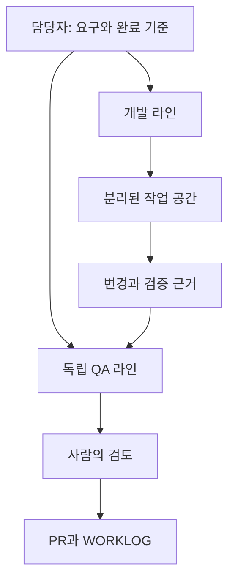
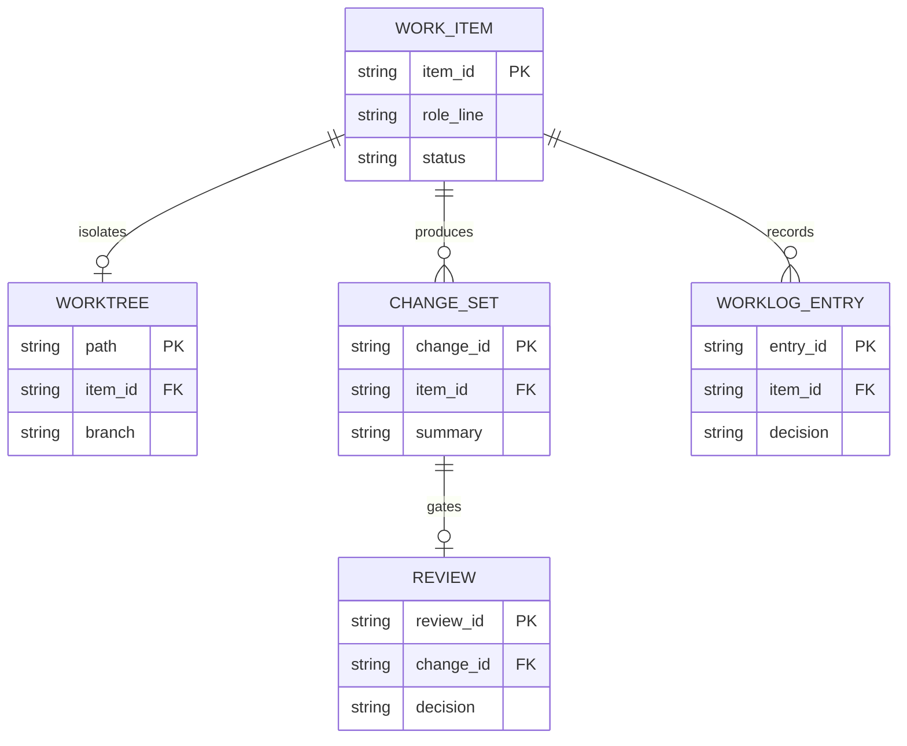

# 에이전트 개발 워크플로우 — 구조도·개념 ERD

작성자 운영 설명을 바탕으로 다시 그린 개념도입니다. 품질 효과 측정이 아닙니다.

## 역할·공간·기록 분리

```mermaid
flowchart TD
  Owner[담당자: 요구와 완료 기준] --> Dev[개발 라인]
  Owner --> QA[독립 QA 라인]
  Dev --> Space[분리된 작업 공간]
  Space --> Change[변경과 검증 근거]
  Change --> QA
  QA --> Review[사람의 검토]
  Review --> Record[PR과 WORKLOG]
```

## 개념 ERD — 작업·검토 기록

```mermaid
erDiagram
  WORK_ITEM {
    string item_id PK
    string role_line
    string status
  }
  WORKTREE {
    string path PK
    string item_id FK
    string branch
  }
  CHANGE_SET {
    string change_id PK
    string item_id FK
    string summary
  }
  REVIEW {
    string review_id PK
    string change_id FK
    string decision
  }
  WORKLOG_ENTRY {
    string entry_id PK
    string item_id FK
    string decision
  }
  WORK_ITEM ||--o| WORKTREE : isolates
  WORK_ITEM ||--o{ CHANGE_SET : produces
  CHANGE_SET ||--o| REVIEW : gates
  WORK_ITEM ||--o{ WORKLOG_ENTRY : records
```
