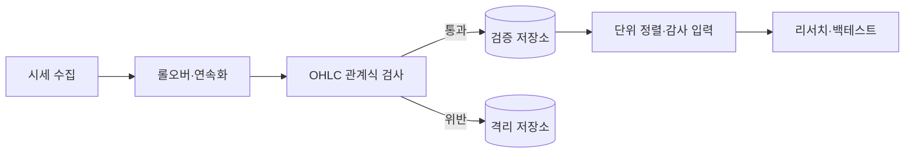
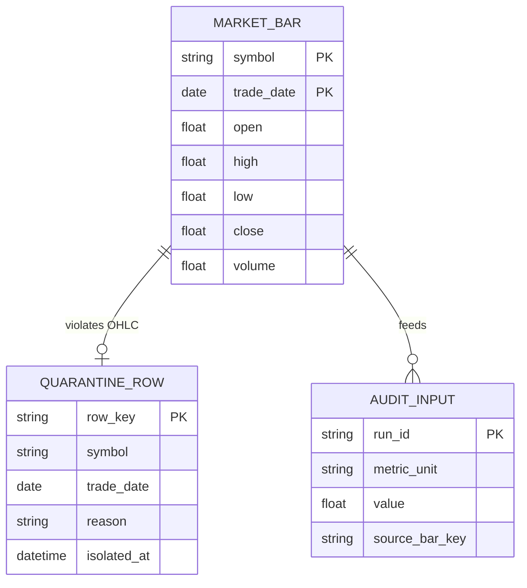

# 금융 데이터 검증 — 구조도·개념 ERD

공개 설명을 위한 개념도입니다. 원본 운영 DB 스키마가 아닙니다.

## 검증·격리 파이프라인

```mermaid
flowchart LR
  Collect[시세 수집] --> Roll[롤오버·연속화]
  Roll --> Check[OHLC 관계식 검사]
  Check -->|통과| Store[(검증 저장소)]
  Check -->|위반| Quarantine[(격리 저장소)]
  Store --> Audit[단위 정렬·감사 입력]
  Audit --> Research[리서치·백테스트]
```

## 개념 ERD — 시세와 격리

```mermaid
erDiagram
  MARKET_BAR {
    string symbol PK
    date trade_date PK
    float open
    float high
    float low
    float close
    float volume
  }
  QUARANTINE_ROW {
    string row_key PK
    string symbol
    date trade_date
    string reason
    datetime isolated_at
  }
  AUDIT_INPUT {
    string run_id PK
    string metric_unit
    float value
    string source_bar_key
  }
  MARKET_BAR ||--o| QUARANTINE_ROW : "violates OHLC"
  MARKET_BAR ||--o{ AUDIT_INPUT : "feeds"
```
