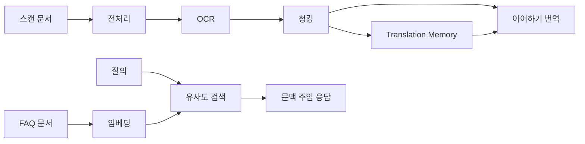
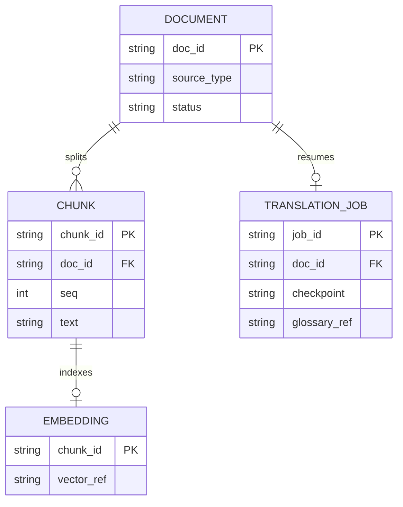

# LLM 문서 처리 — 구조도·개념 ERD

공개 설명을 위한 개념도입니다.

## 문서 처리 흐름

```mermaid
flowchart LR
  Scan[스캔 문서] --> Pre[전처리]
  Pre --> OCR[OCR]
  OCR --> Chunk[청킹]
  Chunk --> TM[Translation Memory]
  Chunk --> Translate[이어하기 번역]
  TM --> Translate
  FAQ[FAQ 문서] --> Embed[임베딩]
  Query[질의] --> Retrieve[유사도 검색]
  Embed --> Retrieve
  Retrieve --> Answer[문맥 주입 응답]
```

## 개념 ERD — 문서·청크·작업

```mermaid
erDiagram
  DOCUMENT {
    string doc_id PK
    string source_type
    string status
  }
  CHUNK {
    string chunk_id PK
    string doc_id FK
    int seq
    string text
  }
  TRANSLATION_JOB {
    string job_id PK
    string doc_id FK
    string checkpoint
    string glossary_ref
  }
  EMBEDDING {
    string chunk_id PK
    string vector_ref
  }
  DOCUMENT ||--o{ CHUNK : splits
  DOCUMENT ||--o| TRANSLATION_JOB : resumes
  CHUNK ||--o| EMBEDDING : indexes
```
