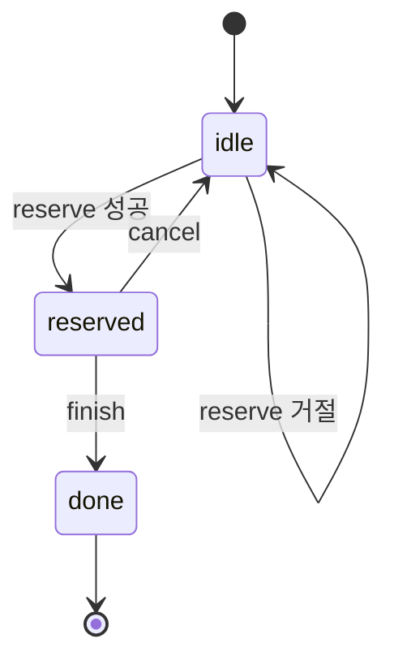
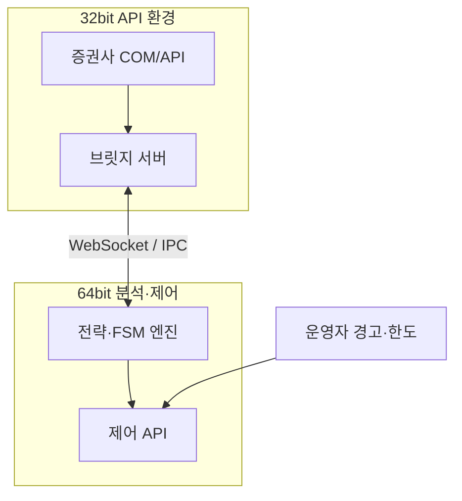
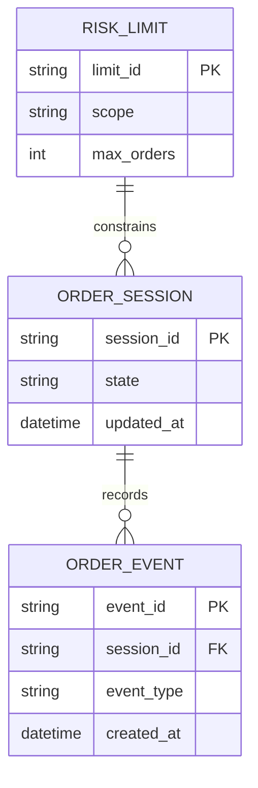

# 주문·운영 안전성 — 구조도·개념 ERD

공개 설명을 위한 개념도입니다. 실계좌 스키마가 아닙니다.

## 주문 상태 FSM

```mermaid
stateDiagram-v2
  [*] --> idle
  idle --> reserved: reserve 성공
  idle --> idle: reserve 거절
  reserved --> done: finish
  reserved --> idle: cancel
  done --> [*]
```

## 32/64비트 환경 브릿지

```mermaid
flowchart TB
  subgraph bit32 [32bit API 환경]
    Broker[증권사 COM/API]
    BridgeSrv[브릿지 서버]
    Broker --> BridgeSrv
  end
  subgraph bit64 [64bit 분석·제어]
    Engine[전략·FSM 엔진]
    API[제어 API]
    Engine --> API
  end
  BridgeSrv <-->|WebSocket / IPC| Engine
  Ops[운영자 경고·한도] --> API
```

## 개념 ERD — 주문 이벤트

```mermaid
erDiagram
  ORDER_SESSION {
    string session_id PK
    string state
    datetime updated_at
  }
  ORDER_EVENT {
    string event_id PK
    string session_id FK
    string event_type
    datetime created_at
  }
  RISK_LIMIT {
    string limit_id PK
    string scope
    int max_orders
  }
  ORDER_SESSION ||--o{ ORDER_EVENT : records
  RISK_LIMIT ||--o{ ORDER_SESSION : constrains
```
