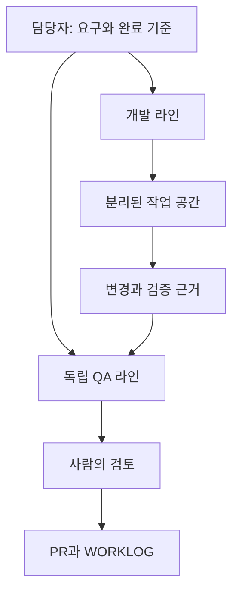

# 개발 역할과 기록 흐름

작성자의 운영 설명을 바탕으로 다시 그린 역할도입니다. 실제 설정·실행 기록이나 측정한 품질 효과를 대신하지 않습니다.

```mermaid
flowchart TD
  Owner[담당자: 요구와 완료 기준] --> Dev[개발 라인]
  Owner --> QA[독립 QA 라인]
  Dev --> Space[분리된 작업 공간]
  Space --> Change[변경과 검증 근거]
  Change --> QA
  QA --> Review[사람의 검토]
  Review --> Record[PR과 WORKLOG]
```
